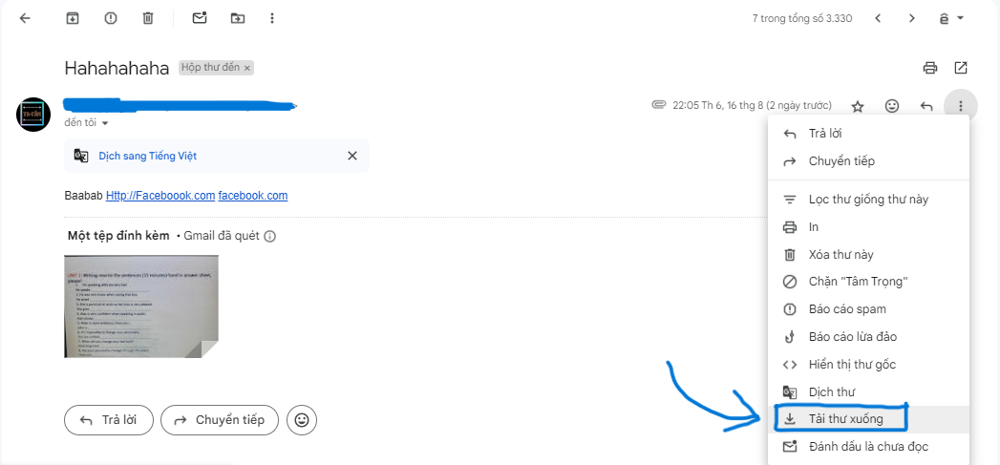

### About emailscanvirus
- `emailscanvirus` is an innovative project designed to analyze malicious components within .eml files. Utilizing the `VirusTotal API` and `Chongluadao API`, the project scans email attachments and embedded content for potential threats. By leveraging VirusTotal's comprehensive virus and malware database, emailscanvirus helps users identify and mitigate security risks associated with email communications, ensuring a safer digital environment. This tool is ideal for cybersecurity professionals and anyone concerned about email security.
### Get file .eml
- Access `https://mail.google.com/` and select the email you want to scan and click download letter
- 


### How to use emailscanvirus tool

- To use the emailscanvirus tool, you will need to obtain an API key from VirusTotal.

#### Get VirusTotal API KEY

- Fistly, you access the link [https://www.virustotal.com/gui/sign-in](https://www.virustotal.com/gui/sign-in)
- On the login screen, log in with your account. If you don't have one, create a new account
- 
- After successfully logging in, click on your profile icon in the top right corner.
- 
- Continue, copy your api key
- 
- Note : I have the key ready
#### Install emailscanvirus tool
- You can use git to download it with the following command:

```
git clone https://github.com/trongtam21/EmailScanVirus
```
- To run the emailscanvirus tool, you need to install the required dependencies.

```
pip install -r requirements.txt
```


#### Run emailscanvirus tool
```
python emailscanvirus.py -f <file eml>
```
- Note that for the first run, you will need to enter the API key, but subsequent runs will not require it.

#### Example
##### Input
> python .\emailscanvirus.py -f .\example.eml

##### Output

```
API KEY VIRUS TOTAL: c9961063b03c943a80cee67af54c437dfc185f741...
Processing file: .\example.eml
Using API key: c9961063b03c943a80cee67af54c437dfc185f741...
From: keylog keylog <keykoger12345@gmail.com>
To: "dotrongtam4321@gmail.com" <dotrongtam4321@gmail.com>
None

============================= IP MALICIOUS CHECK =============================
IP ADDRESS :  209.85.220.41

Malicious: 1, Suspicious: 1, Undetected : 30, Country : US

============================= Content check =============================
http://vietcombankqqq.com

Hihihji
http://kalilinux.org
https://the-tin-dung-master-card.com/
https://faceboollll.com


===== From virustotal =====

http://vietcombankqqq.com  :  Website not working (With status code :  404)
http://kalilinux.org  :  URL is safe.
https://the-tin-dung-master-card.com/  :  URL might be fraudulent!
https://faceboollll.com  :  Website not working (With status code :  404)

===== From Chongluadao.vn database and Google Safe Browsing API =====

http://vietcombankqqq.com  :  Not found in Chongluadao.vn database and Google Safe Browsing API
http://kalilinux.org  :  Not found in Chongluadao.vn database and Google Safe Browsing API
https://the-tin-dung-master-card.com/  :  This website may be unsafe according to community reviews.
https://faceboollll.com  :  Not found in Chongluadao.vn database and Google Safe Browsing API

============================= Attachment Check =============================
Checking attachment 'ATTT-N (1).pdf'...
Checking report...ds remainingg

Attachment 'ATTT-N (1).pdf' result: Not Found in Database
Checking attachment '20240713_071822.jpg'...
Checking report...ds remainingg

Attachment '20240713_071822.jpg' result: Not Found in Database
```
